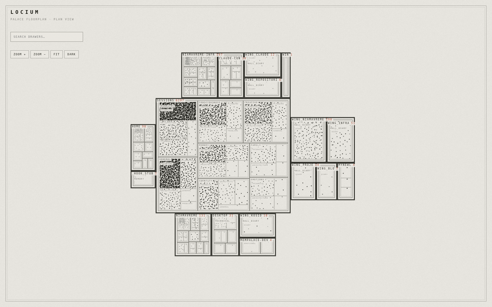
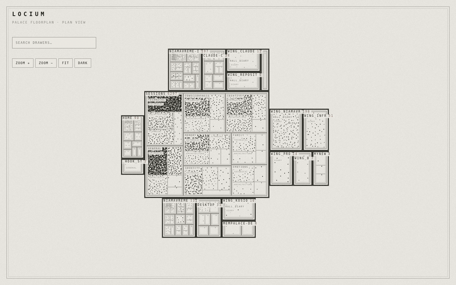
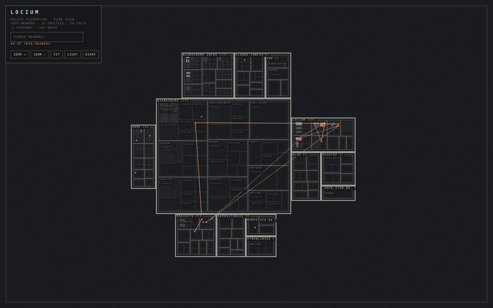

# Locium

A visual explorer for an agent's memory. Locium renders a MemPalace store as
an architect's floorplan — one connected building, wings and halls as blocks,
rooms as chambers, drawers as dots — and records the connections you confirm
between them.

The name comes from *loci* — the classical method of loci, where memories are
placed in imagined locations. Pronounced LOH-see-um.

## Demo

Pan and zoom the building, search to draw a relevance chain through the hits
(solid for strong matches, dotted as relevance fades), switch light/dark, and
click a drawer to fan a star out to its nearest neighbours.

## Install

    python -m venv .venv
    .venv/bin/pip install -e ".[dev]"

## Use

Build the index once, then serve it as often as you like:

    locium build          # read the palace, write the index to ~/.locium/index
    locium serve          # open http://127.0.0.1:7777

**You do not rebuild every time.** `build` writes an index that persists on
disk; `serve` just reads whatever index is already there (and refuses, telling
you to `build`, if none exists). Day to day, `locium serve` is all you run.

Rebuild only when you want the map to reflect **new** memories added since the
last build. `serve` watches for this: it compares the palace's modification
time against the index and shows a banner — *"Palace has changed since this
index was built"* — when the palace has moved on. That's your cue to run
`locium build` again and reload the page. A plain rebuild keeps every existing
drawer exactly where it is and only places the new ones.

(If the `locium` command isn't found, either activate the venv with
`source .venv/bin/activate` or call it as `.venv/bin/locium`.)

Options:

    --palace PATH   MemPalace store (default ~/.mempalace/palace,
                    or $MEMPALACE_PALACE)
    --index PATH    index location (default ~/.locium/index)
    --refit         re-pack every chamber from scratch; MOVES existing drawers
                    (only if you want a clean re-lay — a plain build never does)
    --port N        serve on a specific port (default 7777)

## How it works

`build` copies the palace to a temp directory and reads the copy — it never
opens the live ChromaDB store, which the MemPalace MCP server holds open.
Every drawer carries `wing`, `hall` and `room`, the store's own three-level
hierarchy; Locium draws that hierarchy directly as a floorplan: wings and
halls become blocks sharing a full edge with a connected core, rooms become
chambers inside them, and each drawer is a dot scattered inside its chamber.

Block size is `log(count + 1)`, not proportional to how full a room is — one
wing can hold the vast majority of a real store, and sizing by count would
make most chambers smaller than their own labels. Density of dots shows
fullness instead. A dot's value carries recency (older drawers read fainter,
recent ones read stronger), and it inverts with the theme so "recent" always
reads as more present, not just differently coloured.

Position no longer encodes meaning — proximity on screen means "same room",
not "similar content". Clicking a dot fetches that drawer's full text from
the server (`meta.json` only ever carries a 200-character preview) and
highlights its ten nearest neighbours, found by client-side k-NN over
quantised vectors — that's how semantic closeness stays discoverable without
being drawn as distance. Search embeds your query with the same ONNX model
that produced the stored vectors and additionally matches wing/hall/room
names literally; matches go accent-coloured, everything else dims. The map
never moves for a search — no drawer's coordinate changes.

The hits are also connected by relevance-weighted lines. A search draws a
*chain* — a path through the hits from strongest to weakest, each segment warm
and solid when the match is strong, cooling and going dotted below a similarity
threshold, so the line itself reads as the relevance gradient. Clicking a
drawer instead draws a *star* — rays from that drawer to each of its nearest
neighbours, in the same colour language.

Every drawer is drawn by default, so every hit has a dot. A positive `dot_cap`
can be set to stop a chamber past N drawers from adding more dots (its true
count is still shown) if you'd rather keep the densest rooms readable.

## Stable coordinates

A drawer keeps its coordinate as long as its chamber (`wing`, `hall`, `room`)
is unchanged and that point still falls inside the chamber's current
rectangle; wing/hall/chamber geometry itself is recomputed fresh on every
build. New drawers are packed into the space that's left. Only `--refit`
discards everything and repacks from scratch, and it will invalidate the map
you have memorised.

## Tunnels

Confirming a connection calls `mempalace.palace_graph.create_tunnel`, which
writes to `~/.mempalace/tunnels.json` under a file lock. Nothing is ever
written to ChromaDB.

Tunnel identity is the wing/room pair, so one tunnel exists per pair of rooms
and the drawer ids record the exemplar that prompted it.

## Tests

    .venv/bin/python -m pytest      # build pipeline, API, tunnels
    npx playwright test             # browser
